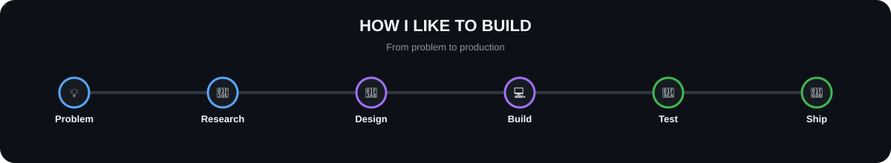

<div align="center">

# 👋🏾 Hey, I'm Bright Akoto


<br />

<a href="https://dhollarsign.vercel.app/">

</a>
<a href="https://github.com/Bryt19">

</a>
<a href="https://www.linkedin.com/in/bright-akoto19">

</a>
<a href="mailto:ac.bryt19@gmail.com">

</a>

</div>

---

## 🧑🏾‍💻 About Me

I'm a **Software Engineering student and developer from Ghana** who enjoys turning ideas into useful, production-ready software. My work spans **frontend engineering, full-stack applications, AI-powered products and Web3**.

I care about building interfaces that feel great to use while keeping the engineering behind them clean, maintainable and scalable. Recently I've been going deeper into **Ethereum smart contracts** and expanding my systems knowledge through **Rust and Bitcoin development**.

```text
Frontend        React • TypeScript • JavaScript • Tailwind CSS • Next.js • Vite
Backend         Node.js • Express • PostgreSQL • Prisma • Supabase
Web3            Solidity • Ethereum • Ethers.js • Smart Contracts
Exploring       Rust • Bitcoin • Lightning Network
```

---

## 🚀 Featured Projects

| Project | Description | Stack | Live |
|---|---|---|---|
| 🔐 **TrustLock** 🥈 *EAG Hackathon 2026* | Ethereum escrow platform — lock funds in smart contracts until agreed conditions are met. No middlemen. | `React` `Solidity` `Ethers.js` `Sepolia` | [Demo ↗](https://trust-lock-seven.vercel.app/) |
| 🤖 **Lumina** | AI support app with a modern conversational interface, typing indicators and response regeneration | `React` `TypeScript` `Vite` `AI` | [App ↗](https://lumina-help.vercel.app/) |
| 📊 **TradeLens** | Finance platform with interactive dashboards and data visualization tools | `React` `TypeScript` `Supabase` | [Demo ↗](https://trade-lens-finance.vercel.app/) |
| 💊 **Klavora** | Centralized pharmacy inventory and workflow management system | `React` `Node.js` `Prisma` `PostgreSQL` | [App ↗](https://klavora.vercel.app/) |
| 🍽️ **Platera** | Restaurant operations platform — menus, orders and day-to-day workflows | `React` `TypeScript` `Supabase` | — |
| 🌱 **Verdis** | Climate-smart agriculture platform with tools for farming decisions and insights | `React` `TypeScript` `Tailwind CSS` | [App ↗](https://verdis-tan.vercel.app/) |

---

## 🛠️ Tech Stack

<p>

</p>

<p>

</p>

---

## ⚙️ How I Like to Build

<div align="center">



</div>

<br />

> **I don't just build interfaces — I think through the problem, design the experience, engineer the solution, test it and ship it.**

---

## 📈 GitHub Activity

<div align="center">


</div>

<div align="center">


</div>

---

## 📫 Let's Connect

<div align="center">

Have an idea worth building? I'm always open to collaborating on software projects, Web3 experiments and open-source work.

<br />

**Build. Learn. Ship. Repeat.**

</div>
